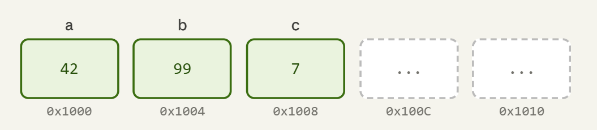

# What is a pointer?
- A pointer is variable that stores **memory address** of another variable or object. Instead of holding a direct value (like a number or a character), a pointer **points to** the location in computer memory where that data is stored. 


- Before moving further — here's what RAM looks like to your program
<p align="center">
  
</p>

## Contents
[1. Smart Pointers](#smart-pointers)
&emsp;[1.1 Defination](#defination) 
&emsp;[1.2 Types](#types) 
&emsp;[1.2 Advantages and Disadvantages](#adv-and-dis)
[2. Unique Pointer](#2-unique-pointer)


> for now leaving the thoery for smart pointers, would jump to unique pointers instead.


---
## 2. Unique Pointer
> “owns a piece of memory exclusively, and automatically deletes it when it’s no longer needed.”
- Only one owner at a time
- Cannot be copied, only moved
- Prevents memory leaks by deleting automatically

**Where You Can Use unique_ptr?**
1. single object
2. class object
3. Dynamic Arrays
4. Managing Resources
5. Returning Objects from Functions
6. Ownership Transfer
7. In Containers
8. Polymorphism

| Advantages | Disadvantages |
| -----------|---------------|
|No Memory Leaks| Cannot Copy |
| Clear Ownership| Not for Shared Ownership |
| Lightweight | Slightly More Complex Syntax |
| Safer Code | Requires Understanding Move Semantics |
| Works with Move Semantics | [coudldn't find more, but click the link to view the syntax for single object &rarr;](#single-object) |

### Single Object
**unique_ptr** &rarr; Owns one **dynamically allocated object** exclusively and <u>*automatically deletes*</u> it when it goes out of scope., you can only transfer the ownership for it using move() method. 

- **Syntax**
```
  std::unique_ptr<type> ptr_name; // Basic declaration
  std::unique_ptr<int> ptr = std::make_unique<int>(10); // creation
```

> Accessing value

```
  *ptr        // dereference
  ptr->function_name_inside_class    // for class objects
```

To view more of it, [check out the cpp files](/phase-1-foundations/smart-pointers/).
